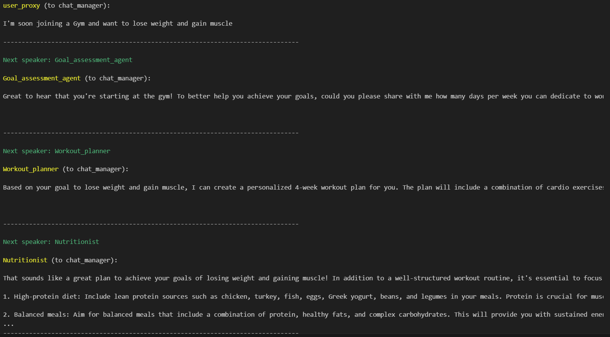

# Fitness Assistant Multi-Agent System

This project implements a multi-agent system using Crew AI to provide comprehensive fitness assistance, including goal assessment, workout planning, and nutritional guidance. The system interacts with the user to understand their fitness goals, assess their current fitness level, and provide personalized workout and nutrition plans.

## Table of Contents

- [Overview](#overview)
- [Features](#features)
- [Setup and Installation](#setup-and-installation)
  - [Prerequisites](#prerequisites)
  - [Installation Steps](#installation-steps)
- [Usage](#usage)
- [Project Structure](#project-structure)
- [Agents Description](#agents-description)
- [Example Interaction](#example-interaction)


## Overview

This system uses a group of AI agents to interact with the user, gather relevant information, and provide personalized fitness plans. The agents include a goal assessment agent, a workout planner agent, and a nutritional guidance agent. These agents collaborate to provide a comprehensive fitness plan tailored to the user's goals and preferences.

## Features

- **Goal Assessment:** Interacts with the user to understand their fitness goals and current fitness level.
- **Workout Planning:** Generates personalized workout routines based on the user's goals and available resources.
- **Nutritional Guidance:** Provides dietary recommendations to complement the workout plan and support fitness goals.

## Setup and Installation

### Prerequisites

- [OpenAI API key](https://beta.openai.com/signup/)

### Installation Steps

1. **Clone the repository:**

   ```bash
   git clone https://github.com/yourusername/fitness-assistant-multi-agent.git
   cd fitness-assistant-multi-agent
   ```
2. **Create a virtual environment and activate it:**
python -m venv venv
source venv/bin/activate   # On Windows use `venv\Scripts\activate`

3. **Install the required packages:**
```pip install -r requirements.txt```

4. **Set up environment variables:**

Create a `.env` file in the project root directory and add your OpenAI API key:
OPENAI_API_KEY=your_openai_api_key

## Usage
To start the interaction with the multi-agent system, run:
`python app.py`

## Project Structure

```plaintext```
fitness-assistant-multi-agent/
│
├── agent.py                # Contains the definition of all the assistant agents
├── app.py                  # Main entry point to start the chat with the multi-agent system
├── requirements.txt        # List of required Python packages
└── .env                    # Environment file to store API keys

## Agents Description
`Goal Assessment Agent`: Evaluates the user's fitness goals and current fitness level through a series of questions.
`Workout Planner Agent`: Creates personalized workout plans based on user goals and constraints.
`Nutritional Guidance Agent`: Provides dietary recommendations and meal plans that align with the user's fitness goals.

## Example Interaction
